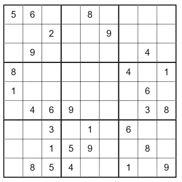
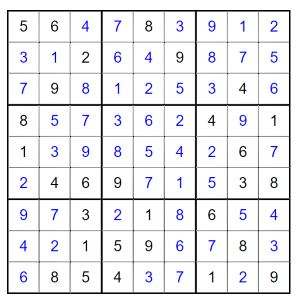

# Sudoku solver kata

Sudoku is a popular puzzle printed on 9x9 square which is divided into 9 sub squares.
The object is to fill empty spaces so that each column, row and sub squares contain every number from 1 to 9.

Rules for sudoku puzzle:
* 9x9 square filled with numbers from 1-9
* No repeated numbers in each horizontal row
* No repeated numbers in each vertical column
* No repeated numbers in each 3x3 sub grid

Limitations
* Limit sudoku grid size to 9x9
* Assume that input is solvable sudoku

Here's unsolved example



And solved example solved



### Example test data:

Value `0` represents empty cell.

F#
~~~fsharp
let unsolved =
    array2D
        [ [ 5; 6; 0; 0; 8; 0; 0; 0; 2 ]
          [ 0; 0; 2; 0; 0; 9; 0; 0; 0 ]
          [ 0; 9; 0; 0; 0; 0; 0; 4; 0 ]
          [ 8; 0; 0; 0; 0; 0; 4; 0; 1 ]
          [ 1; 0; 0; 0; 0; 0; 0; 6; 0 ]
          [ 0; 4; 6; 9; 0; 0; 0; 3; 8 ]
          [ 0; 0; 3; 0; 1; 0; 6; 0; 0 ]
          [ 0; 0; 1; 5; 9; 0; 0; 8; 0 ]
          [ 0; 8; 5; 4; 0; 0; 1; 0; 9 ] ]

let solved =
    array2D
        [ [ 5; 6; 4; 7; 8; 3; 9; 1; 2 ]
          [ 3; 1; 2; 6; 4; 9; 8; 7; 5 ]
          [ 7; 9; 8; 1; 2; 5; 3; 4; 6 ]
          [ 8; 5; 7; 3; 6; 2; 4; 9; 1 ]
          [ 1; 3; 9; 8; 5; 4; 2; 6; 7 ]
          [ 2; 4; 6; 9; 7; 1; 5; 3; 8 ]
          [ 9; 7; 3; 2; 1; 8; 6; 5; 4 ]
          [ 4; 2; 1; 5; 9; 6; 7; 8; 3 ]
          [ 6; 8; 5; 4; 3; 7; 1; 2; 9 ] ]
~~~

Javascript

```javascript
var unsolved = [
  [5, 6, 0, 0, 8, 0, 0, 0, 2],
  [0, 0, 2, 0, 0, 9, 0, 0, 0],
  [0, 9, 0, 0, 0, 0, 0, 4, 0],
  [8, 0, 0, 0, 0, 0, 4, 0, 1],
  [1, 0, 0, 0, 0, 0, 0, 6, 0],
  [0, 4, 6, 9, 0, 0, 0, 3, 8],
  [0, 0, 3, 0, 1, 0, 6, 0, 0],
  [0, 0, 1, 5, 9, 0, 0, 8, 0],
  [0, 8, 5, 4, 0, 0, 1, 0, 9],
];

var solved = [
  [5, 6, 4, 7, 8, 3, 9, 1, 2],
  [3, 1, 2, 6, 4, 9, 8, 7, 5],
  [7, 9, 8, 1, 2, 5, 3, 4, 6],
  [8, 5, 7, 3, 6, 2, 4, 9, 1],
  [1, 3, 9, 8, 5, 4, 2, 6, 7],
  [2, 4, 6, 9, 7, 1, 5, 3, 8],
  [9, 7, 3, 2, 1, 8, 6, 5, 4],
  [4, 2, 1, 5, 9, 6, 7, 8, 3],
  [6, 8, 5, 4, 3, 7, 1, 2, 9],
];
```

## TIPS

Here's some implementation tips which can help. Tips are hidden to avoid spoiler.

<details>
<summary>Tip 1: First test and solve function signature</summary>

Solve should take `unsolved` 2d array as input and return `solved` 2d array as result.
Write solve function and test which asserts that when given unsolved input solve returns solved result.

Make sure to assert 2d array contents properly.

</details>

<details>
<summary>Tip 2: Loop structures </summary>

Solving algorithm should iterate all cells and replace them with solved result.

Write test to assert that all empty cells are changed to -1 for example.
After implementing this you should have base looping structures in place for starting to add logic. 
</details>

<details>
<summary>Tip 3: Test input for horizontal and vertical checks</summary>

You can reuse solved test data and just empty one column or row to use as a input for solve function.

</details>

<details>
<summary>Tip 4: Algorithm help</summary>

One way to solve problem is to use backtracking and recursion

    1. For each cell in grid
    2. For each number in 1 to 9 
    3. check if number can be placed into cell
    4. if yes, place number into grid and try to solve again with updated grid
    5. if no, remove placed number and check next number

</details>

Happy programming!
